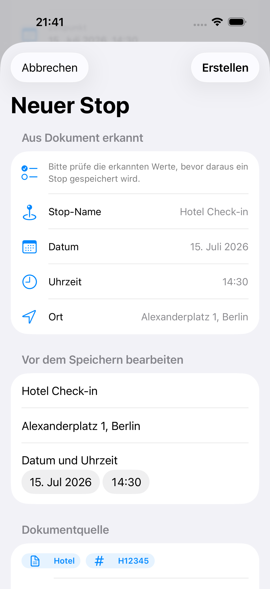

# TripFlow iOS

TripFlow ist eine lokale iOS-App fuer Reiseplanung. Version 0.2 hilft dabei, Trips, Stops, Tagesplanung, Kartenpunkte und reale Reiseunterlagen an einem Ort zu verwalten.

Der Fokus liegt auf einem klaren Portfolio-Use-Case: Reiseunterlagen koennen gescannt oder als Bild beziehungsweise PDF importiert werden. TripFlow erkennt relevante Reisedaten daraus und macht daraus pruefbare Stop-Vorschlaege.

## Demo


Der kurze Ablauf zeigt Trip-Status, Tagesplanung mit Karte und den Review-Schritt fuer erkannte Reisedaten aus einer Reiseunterlage.

## Screenshots

| Trip-Uebersicht | Trip-Detail | Stop-Review |
| --- | --- | --- |
|  |  |  |

Die Screenshots zeigen den aktuellen 0.2-Kern: Trip-Status auf einen Blick, Timeline mit Kartenbezug und die ausdrueckliche Review-Entscheidung vor dem Speichern eines erkannten Stops.

## Technische Highlights

- Echter Dokumenteingang: Bilder, PDFs und VisionKit-Scans werden lokal in OCR-Text umgewandelt.
- OCR-assisted Stop Creation: Aus Dokumenttext entsteht ein editierbarer Stop-Vorschlag statt einer stillen Auto-Speicherung.
- Testbare Business-Logik: Parser, Timeline, Statuslogik und Validierung liegen ausserhalb der SwiftUI-Views.
- Local-first MVP: SwiftData speichert Trips, Stops und Reiseunterlagen ohne Account, Cloud oder externe APIs.
- MapKit-Integration: Stops mit Koordinaten werden als reiserelevante Kartenpunkte dargestellt.
- Reproduzierbarer Showcase: Screenshots werden ueber einen UI-Test mit stabilen Demo-Daten erzeugt.

## Portfolio-Flow

Der wichtigste MVP-Flow ist bewusst klein gehalten:

1. Reiseunterlage scannen oder als Bild beziehungsweise PDF importieren
2. Reisedaten wie Datum, Uhrzeit, Ort und Referenz erkennen
3. Erkannte Daten vor dem Speichern der Unterlage pruefen
4. Stop-Vorschlag in einer eigenen Review-Ansicht pruefen und korrigieren
5. Stop erst nach einer zweiten Bestaetigung im Trip speichern

Damit zeigt TripFlow nicht nur CRUD, sondern einen nachvollziehbaren produktnahen Workflow: Aus unstrukturiertem Dokumenttext entsteht ein geplanter Reise-Stop.

## Projektstatus

TripFlow ist aktuell auf Version 0.2 erweitert. Der Stand zeigt den Kernnutzen der App lokal und ohne externe Infrastruktur: Trips planen, Stops organisieren, echte Reiseunterlagen einlesen und erkannte Daten vor dem Speichern bewusst pruefen.

Der aktuelle 0.2-Stand und der markierte MVP-Stand sind im [Changelog](CHANGELOG.md) dokumentiert.

Der stabile MVP-Snapshot ist als Git-Tag [`v0.1.0-mvp`](https://github.com/KhoiiHa/TripFlow-iOS/tree/v0.1.0-mvp) markiert.

Eine kurze Einordnung der Produkt- und Architekturentscheidungen steht in der [Case Study](CASE_STUDY.md).

Fertige Kurztexte fuer GitHub, LinkedIn und Bewerbung stehen im [Portfolio Pitch](PORTFOLIO_PITCH.md).

Weitere Ideen wie Widgets, App Intents oder breiteres Smart Parsing gehoeren in spaetere, getrennte Iterationen.

## MVP-Funktionen

- Trips mit optionalem Start- und Enddatum erstellen und bearbeiten
- Stops mit Ort, Datum, Uhrzeit und optionalen Koordinaten planen
- Tages-Timeline aus geplanten Stops erzeugen
- Stops mit Koordinaten auf einer MapKit-Karte anzeigen
- Reiseunterlagen mit VisionKit scannen oder als Bild beziehungsweise PDF importieren
- Text aus Bildern, Scans und PDFs lokal mit Vision erkennen
- Erkannte Daten bereits im Dokumententwurf pruefen
- OCR-Text nach Datum, Uhrzeit, Ort, Flugnummer, Zugnummer und Referenznummer parsen
- Erkannte Dokumentdaten in einer Review-Ansicht pruefen
- Aus Reiseunterlagen vorgeschlagene Stops erstellen
- Einfacher Planungsstatus pro Trip: Empty, Planning, Ready

## Architektur

TripFlow ist als einfache SwiftUI-App mit MVVM aufgebaut.

- `Models`: SwiftData-Modelle fuer Trips, Stops und Reiseunterlagen
- `Views`: SwiftUI-Screens fuer Trip-Liste, Trip-Detail, Stop-Detail und Dokument-Detail
- `ViewModels`: UI-State, Validierung und Screen-Aktionen
- `Services`: Business-Logik fuer Trips, Stops, Timeline, Map, Dokumente und Parser
- `Components`: wiederverwendbare UI-Bausteine wie Status-Badges

Die App bleibt bewusst lokal-first. Es gibt kein Account-System, keinen Cloud-Sync und keine externen Booking- oder Social-Features.

## Tech Stack

- Swift
- SwiftUI
- SwiftData
- MVVM
- MapKit
- Vision / VisionKit fuer lokale OCR- und Scan-Flows
- XCTest / Swift Testing

## Tests

Die Tests decken zentrale MVP-Logik ab:

- Trip-Validierung und Trip-Zusammenfassung
- Stop-Erstellung, Koordinaten und Timeline-Sortierung
- Map-Daten und Kartenregionen
- Dokument-Erstellung und Dokument-Detail-Logik
- Bild-, PDF- und Scanner-Import ohne vorzeitige Speicherung
- OCR-/Dokumentparser fuer Datum, Uhrzeit, Ort und Referenzen
- Document-to-Stop-Review, zweistufige Bestaetigung und Validierung

Ausfuehren:

```sh
DEVELOPER_DIR=/Applications/Xcode.app/Contents/Developer xcodebuild test -project TripFlow.xcodeproj -scheme TripFlow -destination 'platform=iOS Simulator,name=iPhone 17' -only-testing:TripFlowTests
```

Portfolio-Screenshots neu erzeugen:

```sh
DEVELOPER_DIR=/Applications/Xcode.app/Contents/Developer xcodebuild test -project TripFlow.xcodeproj -scheme TripFlow -destination 'platform=iOS Simulator,name=iPhone 17' -only-testing:TripFlowUITests/TripFlowUITests/testCapturePortfolioScreenshots
```

## MVP-Grenzen

Nicht Teil des MVP:

- Authentifizierung
- Cloud-Sync
- Firebase
- User Accounts
- geteilte Trips
- Booking-Systeme
- Social Features
- Wetter, Budget oder Routenoptimierung

Diese Grenzen halten das Projekt klein, reviewbar und passend fuer ein fokussiertes iOS-Portfolio.
