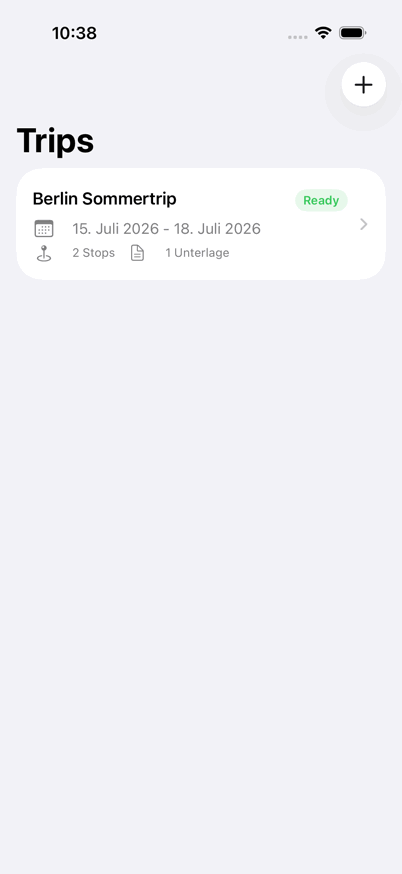
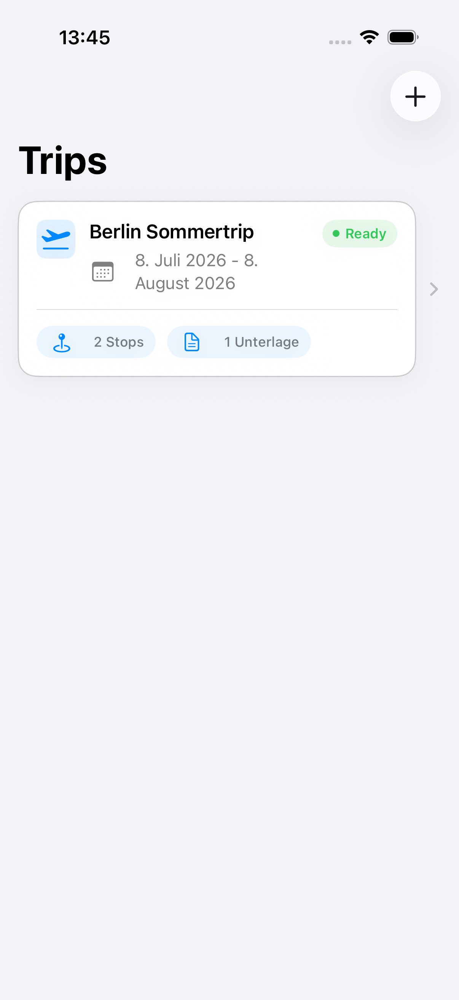
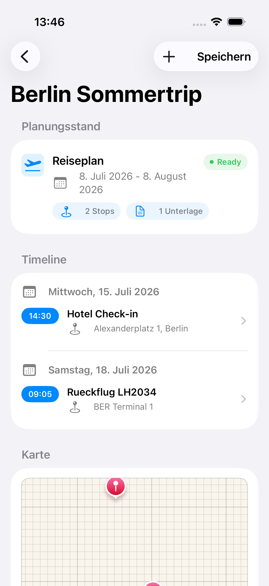
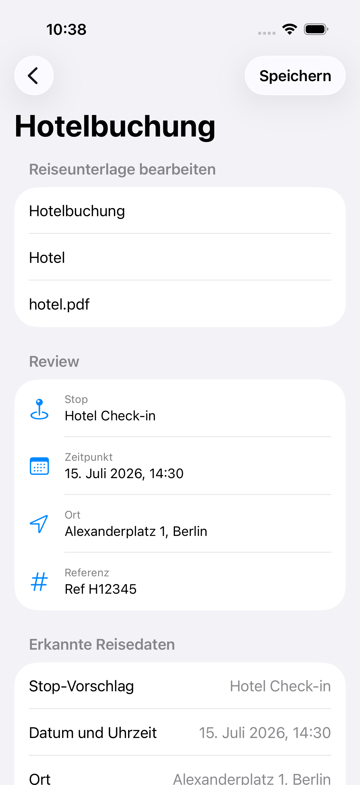

# TripFlow iOS

TripFlow ist eine lokale iOS-App fuer Reiseplanung. Der MVP hilft dabei, Trips, Stops, Tagesplanung, Kartenpunkte und Reiseunterlagen an einem Ort zu verwalten.

Der Fokus liegt auf einem klaren Portfolio-Use-Case: Reiseunterlagen koennen als Text erfasst werden, TripFlow erkennt relevante Reisedaten daraus und macht daraus pruefbare Stop-Vorschlaege.

## Demo



Der kurze Ablauf zeigt Trip-Status, Tagesplanung mit Karte und den Review-Schritt fuer erkannte Reisedaten aus einer Reiseunterlage.

## Screenshots

| Trip-Uebersicht | Trip-Detail | Dokument-Review |
| --- | --- | --- |
|  |  |  |

Die Screenshots zeigen den aktuellen MVP-Kern: Trip-Status auf einen Blick, Timeline mit Kartenbezug und den Review-Schritt fuer erkannte Reisedaten aus einer Reiseunterlage.

## Portfolio-Flow

Der wichtigste MVP-Flow ist bewusst klein gehalten:

1. Reiseunterlage mit OCR-Text erfassen
2. Reisedaten wie Datum, Uhrzeit, Ort und Referenz erkennen
3. Stop-Vorschlag in einer Review-Ansicht pruefen
4. Name, Datum und Uhrzeit bei Bedarf korrigieren
5. Stop erst nach Bestaetigung im Trip speichern

Damit zeigt TripFlow nicht nur CRUD, sondern einen nachvollziehbaren produktnahen Workflow: Aus unstrukturiertem Dokumenttext entsteht ein geplanter Reise-Stop.

## Projektstatus

TripFlow ist aktuell als kompakter Portfolio-MVP abgeschlossen. Der Stand zeigt den Kernnutzen der App lokal und ohne externe Infrastruktur: Trips planen, Stops organisieren, Reiseunterlagen auswerten und erkannte Daten vor dem Speichern bewusst pruefen.

Der markierte MVP-Stand ist im [Changelog](CHANGELOG.md) dokumentiert.

Weitere Ideen wie echter Dokumentimport, VisionKit-Scanner-Ausbau, Widgets oder App Intents gehoeren bewusst nicht mehr in diesen MVP-Abschluss, sondern in spaetere, getrennte Iterationen.

## MVP-Funktionen

- Trips mit optionalem Start- und Enddatum erstellen und bearbeiten
- Stops mit Ort, Datum, Uhrzeit und optionalen Koordinaten planen
- Tages-Timeline aus geplanten Stops erzeugen
- Stops mit Koordinaten auf einer MapKit-Karte anzeigen
- Reiseunterlagen mit Dokumenttyp, Dateiname und OCR-Text erfassen
- OCR-Text nach Datum, Uhrzeit, Ort, Flugnummer, Zugnummer und Referenznummer parsen
- Erkannte Dokumentdaten in einer Review-Ansicht pruefen
- Aus Reiseunterlagen vorgeschlagene Stops erstellen
- Einfacher Planungsstatus pro Trip: Empty, Planning, Ready

## Architektur

TripFlow ist als einfache SwiftUI-App mit MVVM aufgebaut.

- `Models`: SwiftData-Modelle fuer Trips, Stops und Reiseunterlagen
- `Views`: SwiftUI-Screens fuer Trip-Liste, Trip-Detail, Stop-Detail und Dokument-Detail
- `ViewModels`: UI-State, Validierung und Screen-Aktionen
- `Services`: Business-Logik fuer Trips, Stops, Timeline, Map, Dokumente und Parser
- `Components`: wiederverwendbare UI-Bausteine wie Status-Badges

Die App bleibt bewusst lokal-first. Es gibt kein Account-System, keinen Cloud-Sync und keine externen Booking- oder Social-Features.

## Tech Stack

- Swift
- SwiftUI
- SwiftData
- MVVM
- MapKit
- Vision / VisionKit als Ziel fuer OCR-Flows
- XCTest / Swift Testing

## Tests

Die Tests decken zentrale MVP-Logik ab:

- Trip-Validierung und Trip-Zusammenfassung
- Stop-Erstellung, Koordinaten und Timeline-Sortierung
- Map-Daten und Kartenregionen
- Dokument-Erstellung und Dokument-Detail-Logik
- OCR-/Dokumentparser fuer Datum, Uhrzeit, Ort und Referenzen
- Document-to-Stop-Review und Validierung

Ausfuehren:

```sh
DEVELOPER_DIR=/Applications/Xcode.app/Contents/Developer xcodebuild test -project TripFlow.xcodeproj -scheme TripFlow -destination 'platform=iOS Simulator,name=iPhone 17' -only-testing:TripFlowTests
```

## MVP-Grenzen

Nicht Teil des MVP:

- Authentifizierung
- Cloud-Sync
- Firebase
- User Accounts
- geteilte Trips
- Booking-Systeme
- Social Features
- Wetter, Budget oder Routenoptimierung

Diese Grenzen halten das Projekt klein, reviewbar und passend fuer ein fokussiertes iOS-Portfolio.
